# DISCORD CLONE CLIENT DOCUMENTATION

 

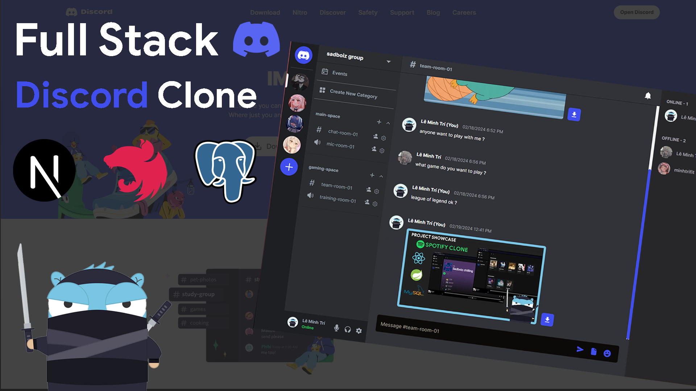

🎓 📚 Realtime chat & video call app inspired from [Discord](https://discord.com)

This project includes two repository (Client and Server), you can checkout **[server repository](https://github.com/minhtrifit/discord-clone-server)**

## 💻 Technical Stack

<p align="left"> <a href="https://reactjs.org/" target="_blank" rel="noreferrer">  </a> <a href="https://tailwindcss.com/" target="_blank" rel="noreferrer">  </a> <a href="https://www.typescriptlang.org/" target="_blank" rel="noreferrer">  </a> </p>

- [Next.js14](https://nextjs.org) - The React Framework for the Web
- [React.js](https://react.dev) - The library for web and native user interfaces
- [Shadcn UI](https://ui.shadcn.com) - Beautifully designed components that you can copy and paste into your apps. Accessible. Customizable. Open Source.
- [Tailwind CSS](https://tailwindcss.com) - Rapidly build modern websites without ever leaving your HTML
- [TypeScript](https://www.typescriptlang.org) - JavaScript with syntax for types.

## ⚙️ Config .env file

Config [.env]() file in root dir with path `./.env`

- [Github Oauth setup](hhttps://docs.github.com/en/apps/oauth-apps/building-oauth-apps/creating-an-oauth-app)

```bash
NEXTAUTH_URL=http://localhost:3000
NEXTAUTH_SECRET=minhtrifit
GITHUB_ID=
GITHUB_SECRET=
NEXT_PUBLIC_API_URL=http://localhost:5000
NEXT_ADMIN_CODE=admin
NEXT_PUBLIC_SUPABASE_URL=https://your_project_id.supabase.co
NEXT_PUBLIC_SUPABASE_HOST=your_project_id.supabase.co
NEXT_PUBLIC_SUPABASE_ANON_KEY=your_project_key
```

- [Supabase setup](https://supabase.com/docs/guides/getting-started/tutorials/with-nextjs)

- To get **Supabase** config
  Go to **Project Settings** > General to get **your_project_id**

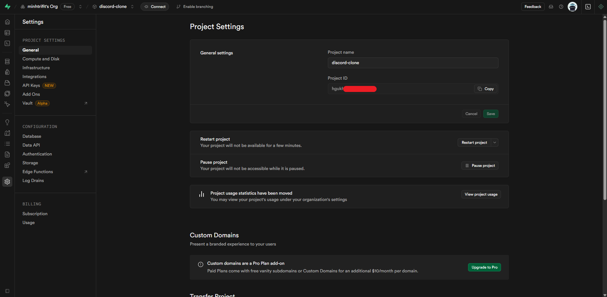

- Now move on **API Keys** > General to get **ANON_KEY**

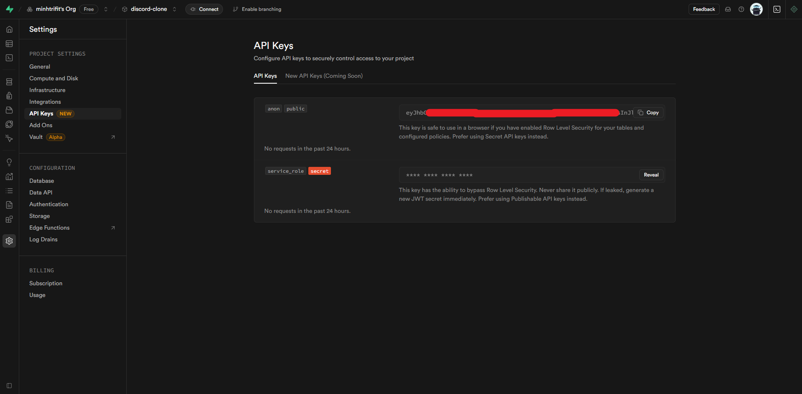

## ⚙️ Config Supabase project

For using upload file feature, you need to enable **storage** service

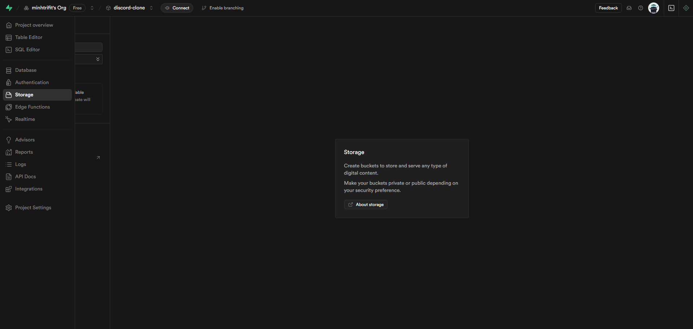

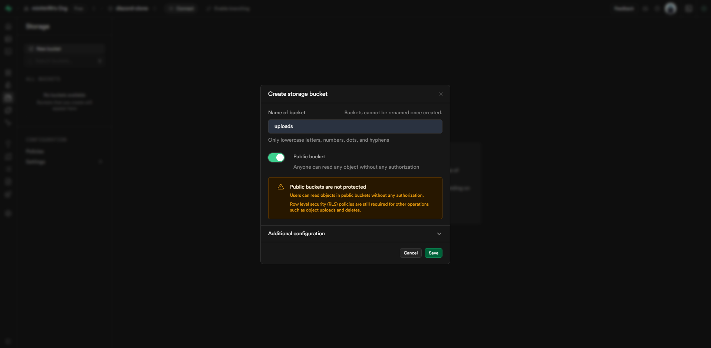

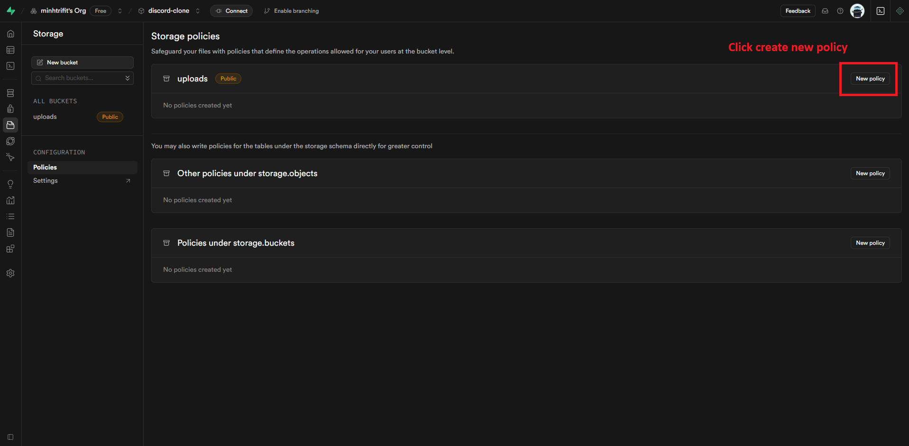

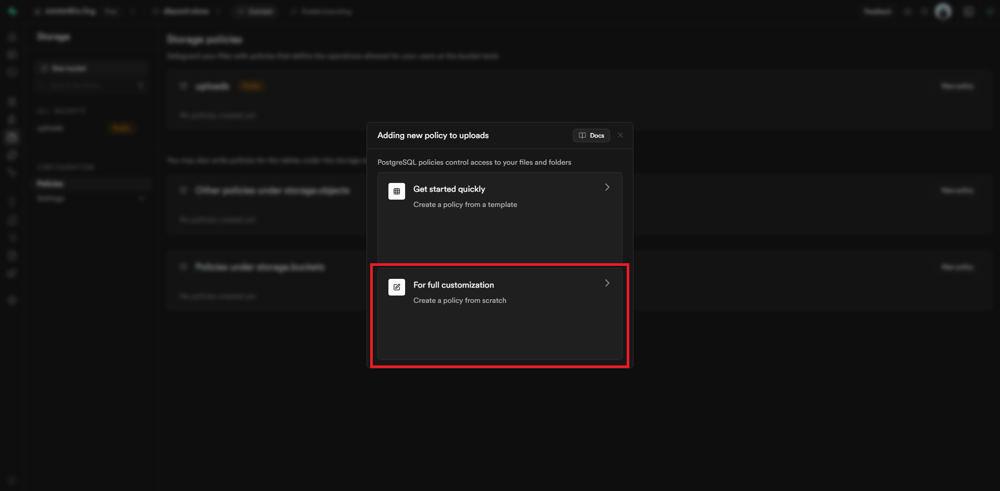

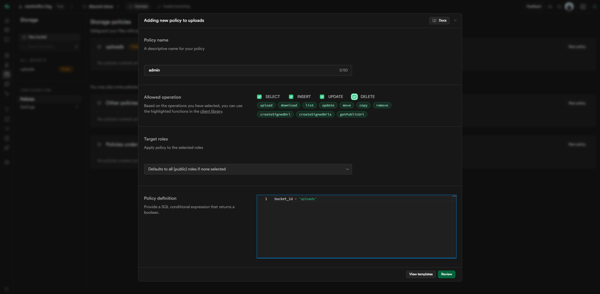

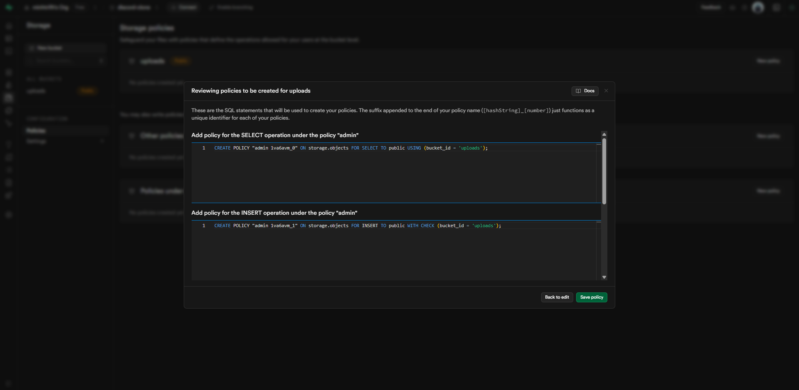

## 📦 Installation

Intall packages & dependencies

```console
npm install
```

Or install packages with legacy peer dependencies.

```console
npm install --legacy-peer-deps
```

Run client project (supported by [Create Next App](https://nextjs.org/docs/getting-started/installation))

```console
npm run dev
```

# ⚡️ Project Showcase

Landing Page:

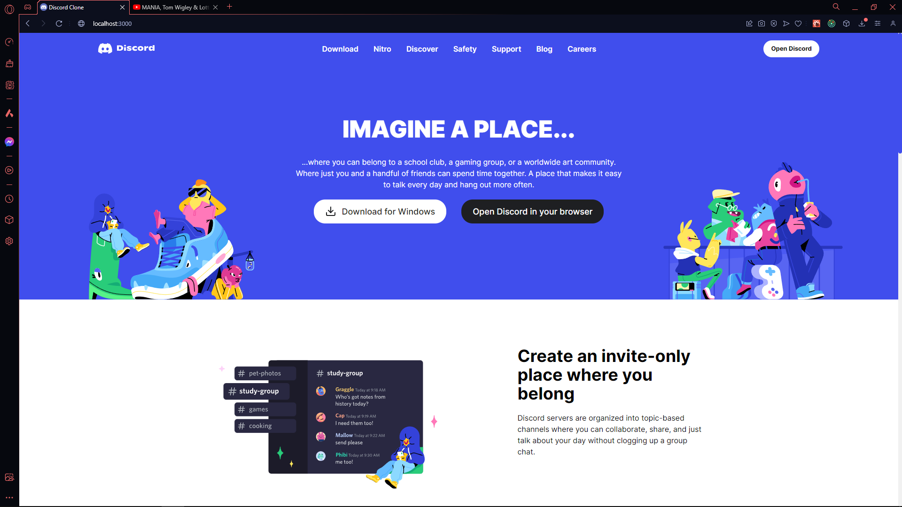

Login Page:

- Email & password login
- Oauth with Github login

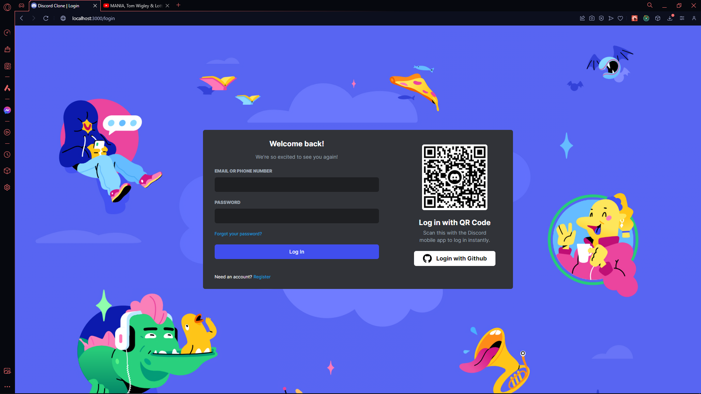

Register Page:

- Admin passcode for register admin account

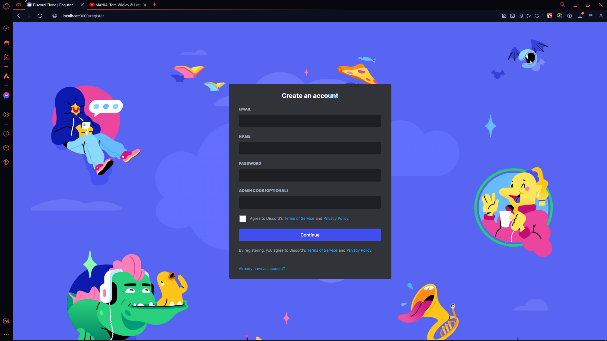

Dashboard:

- Realtime friend request (all friend, add friend, pending friend)
- Realtime direct message

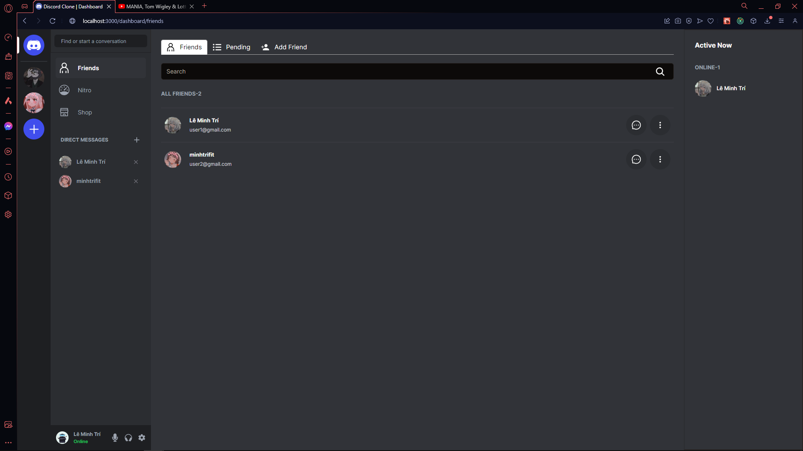

Chat Page:

- Realtime text chat
- Realtime file chat (image, pdf, docx, xlsx)

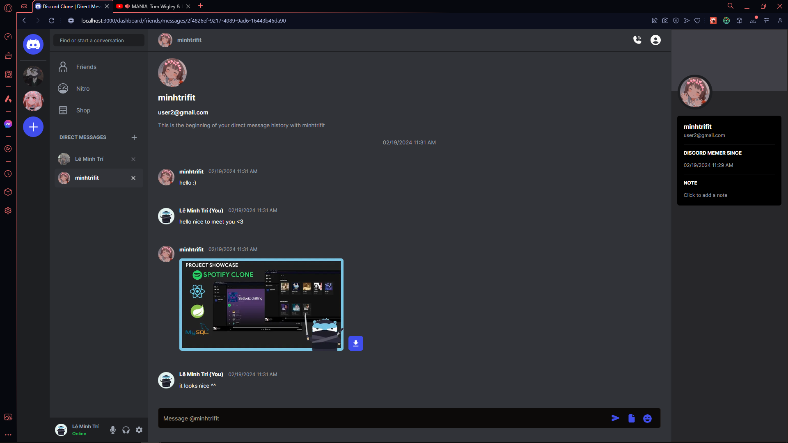

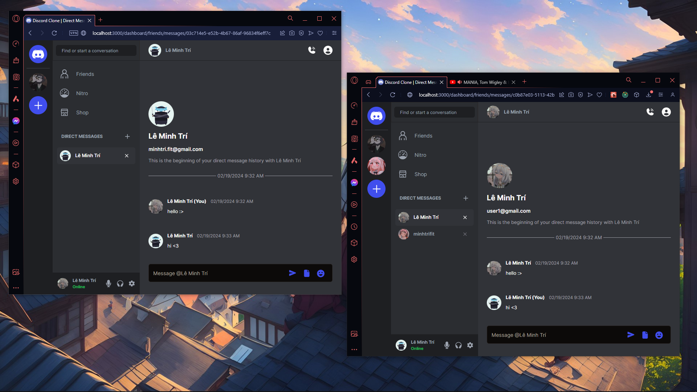

Server page:

- Group realtime chat
- Joining server by invite link

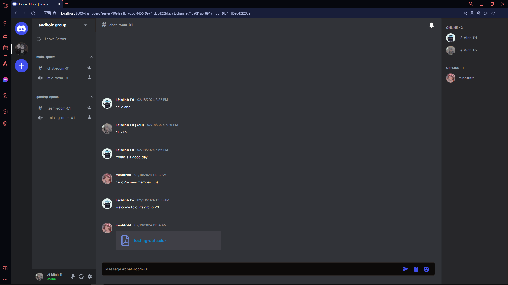

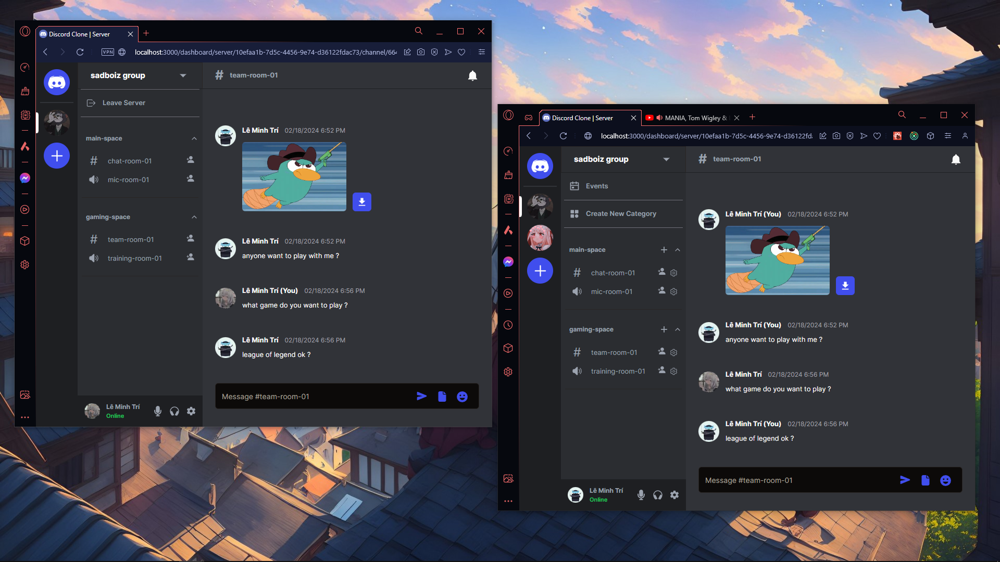

Admin page:

- View users analysis
- View servers analysis
- View storage charts

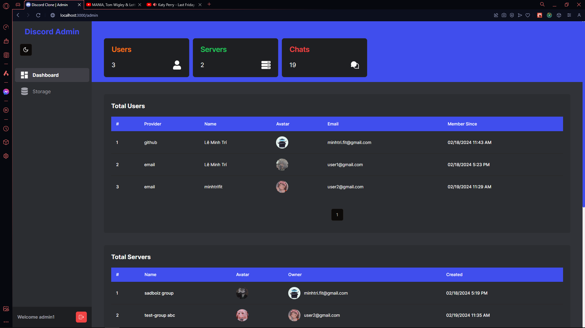

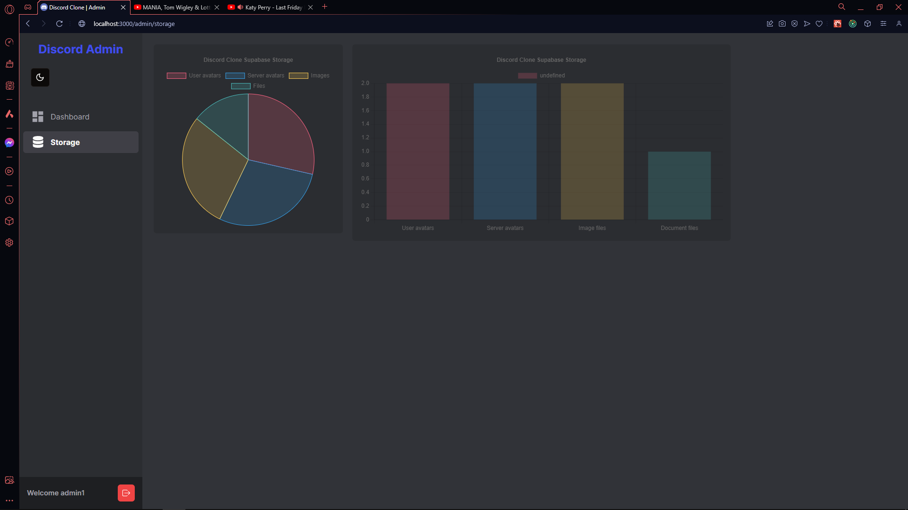

## ▶️ YouTube Demo

[](https://youtu.be/L8ixcX2tIdk)

## 💌 Contact

- Author - [minhtrifit](https://minhtrifitdev.netlify.app)
- [Github](https://github.com/minhtrifit)

> CopyRight© minhtrifit
